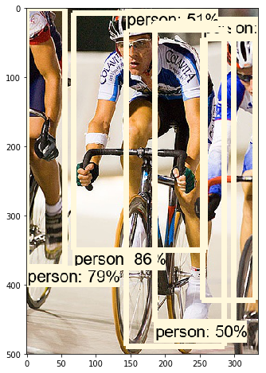
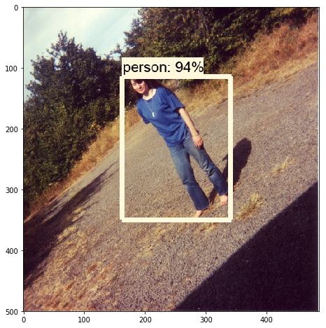
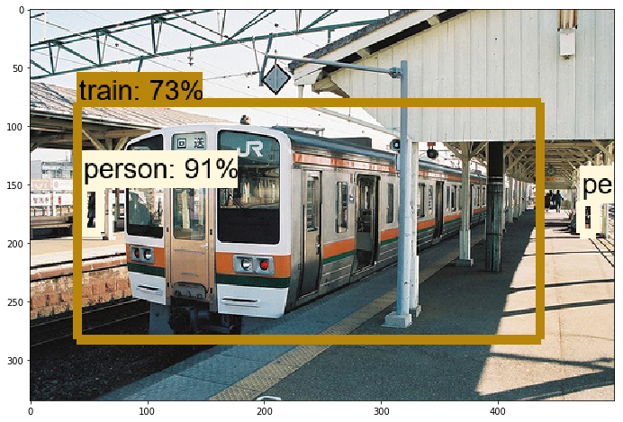
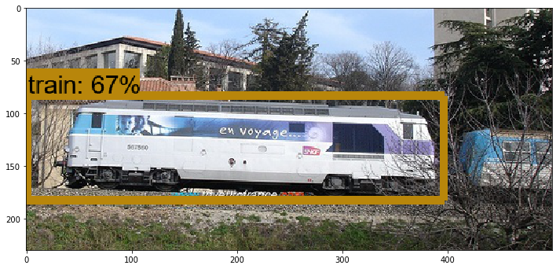
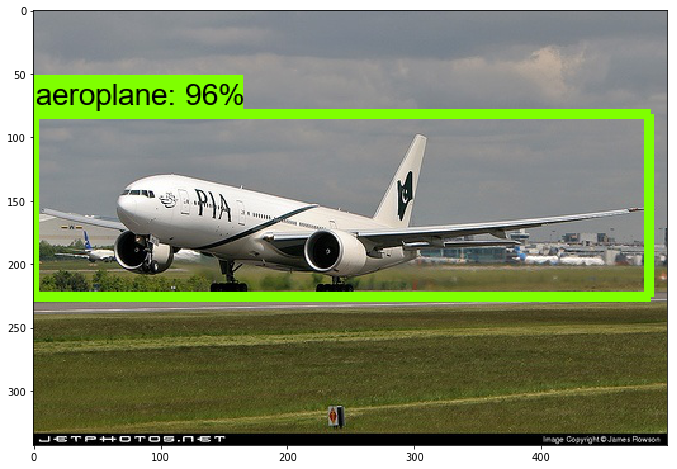
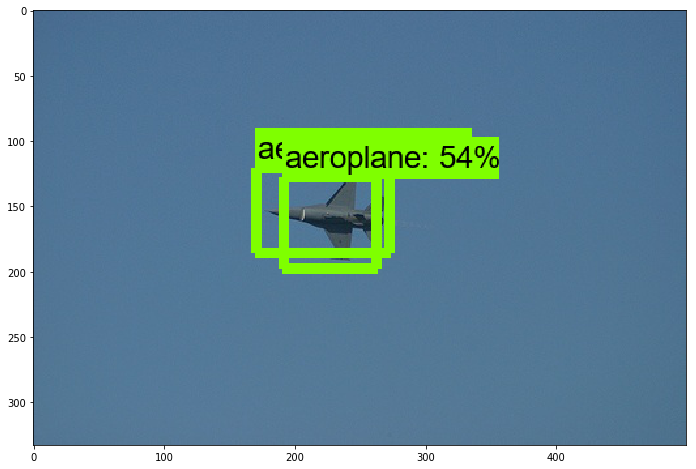

## 利用TensorFlow Object Detection API采用Faster R-CNN + Inception_ResNet_v2来训练自己的目标检测模型
- 采用的数据集：VOC 2012
- 因为该项目文件过多，上传比较麻烦，所以，自己记录了一下实现笔记。
    - 上传的frozen_inference_graph.pb为自己训练的模型
    - pascal_label_map.pbtxt为其对应的标签
    - train.py为模型微调进行训练的文件
    - object_detection_voc.ipynb为模型测试文件
- 整个项目大致分为了三个步骤：
    - 数据的准备、模型的训练、调参导出模型及预测

## 笔记

文档：一、数据集的准备.note

链接：http://note.youdao.com/noteshare?id=08011e674ffb60f29ec4ad29bed5c526&sub=329FD67E4004413BB9A02D0D643EB763

文档：二、模型的训练.note

链接：http://note.youdao.com/noteshare?id=b30d88976102b1657f1b46b081b5813e&sub=FB1A1432936E4314B3B4BB9CBE6894F0

文档：三、导出模型并预测单张图片.note

链接：http://note.youdao.com/noteshare?id=61e534af224b35a5fe15dae93249ec82&sub=D067DC3818344C258BD2158AE7FC148A

## 测试效果

