# 散养牛数据采集项目

[TOC]

## 背景及目的

1、牛在栏中散养，需要采集三张脸（左侧脸、正脸、右侧脸），因为人的靠近，牛会后退，给采集带来很大难度，采集时间也会拉长。

2、散养牛较多，只有喂草料的时间，牛才会靠近栏杆吃草，一天喂两次草料，每次牛吃草料大约20分钟左右，因此，时间短，单只牛拍摄效率低下。

3、通过采集规范和算法来实现程序对视频中牛脸数据的采集，为模型快速增加数据来源，降低人工、时间成本。

## 采集规范

**1、采集说明**

1、同一栏牛需要采集两个视频，分为左中脸视频的采集和中右脸视频的采集。

2、视频文件命名规则：牛场_栏舍_采集日期\_左中脸、牛场\_栏舍\_采集日期\_中右脸，如（昌平牛场\_1舍\_9月29日\_左中脸、昌平牛场\_1舍_9月29日\_中右脸）

 

**2、采集要求**

**左中脸视频的采集：**

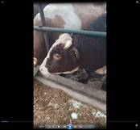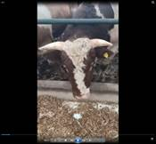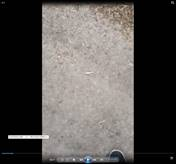

 

1、采用竖屏拍摄，从牛的左侧开始视频采集，只采集牛的左脸和中脸。

2、在两头牛的视频采集间隙，人为设置空白（可以拍摄地面）。

3、在视频采集过程中，需要做好三次停顿（左脸、中脸、地面），左脸和中脸各需要停留3秒，地面停留3 ~ 5秒，在地面停留阶段，可以做好下一头牛的拍摄准备。

 

**右中脸视频的采集：**

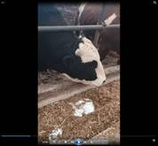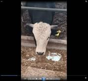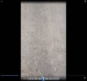

1、采用竖屏拍摄，从牛的右侧开始视频采集，只采集牛的右脸和中脸。

2、在两头牛的视频采集间隙，人为设置空白（可以拍摄地面）。

3、在视频采集过程中，需要做好三次停顿（右脸、中脸、地面），右脸和中脸各需要停留3秒，地面停留3 ~ 5秒，在地面停留阶段，可以做好下一头牛的拍摄准备。

**视频采集注意事项：**

1、在停顿期间，要确保相机的稳定，不要出现大幅晃动，尽量保持屏幕中只有正在拍摄的目标牛头。拍摄距离不宜过远或过近，牛角、牛耳尽量不要出镜。

2、在一个视频中，对于已经拍摄过的牛不要返回再次拍摄。

3、采集时，如果遇到脸部有严重遮挡的牛头（如下图），直接略过该牛，不予拍摄。

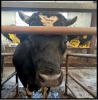

 

## 算法处理

1、通过采集规范中人为设置的采集空白来区分不同的牛，使用边框检测模型来判断牛脸位置，使用关键点角度模型判断牛的左中右脸，根据预测精度来控制采集图像的质量。

2、使用Canopy算法进行粗聚类确定聚类中心数量，再用kmeans进行聚类

特征：使用牛脸识别模型来生成牛脸特征向量（4096维）

\# 同一视频中的中脸图片聚类效果较好

\# 不同视频中的中脸图片聚类效果较差

\# 原因：同一视频中，同一头牛的中脸图片具有连续性，相似性更高

主要参数：T1，T2

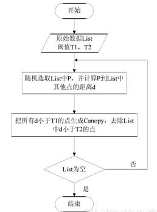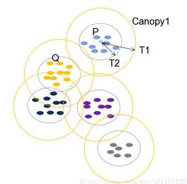

3、类内距离判断（0.997）

0.997是根据牛脸识别模型区分不同牛脸的特征距离得出的一个值

情况一：不同牛分到一起

情况二：同一头牛被分开

两种情况同时存在

## 数据处理存储与算法调试

1、散养牛视频的合并。

**merge_output.py**

**merge_file.py**

**merge_merge.py**

**base_processer.py**

**start_process.py**

(1)   merge_output.py

将两个output下黄牛的文件夹进行比对合并。

Output文件夹结构图：

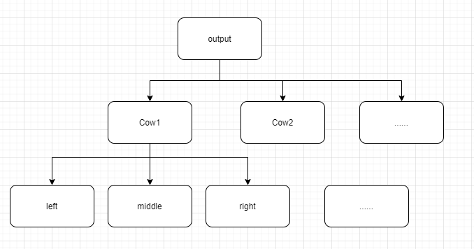

主要参数：stay_ratio=0.55, dis_ratio=0.75

将output1中的牛作为base，计算每头牛所有中脸图片模型推理后向量的平均值，与output2中的每头牛下中脸图片模型推理后的向量计算欧式距离，如果output1中的一头牛中脸图片的平均向量在距离上与output2一头牛中一个中脸图片的向量小于0.75，则认为这张图片与output1中的这头牛是同一头牛，如果output2中这头牛中脸图片有55%以上的图片属于这种情况，则认为output2中的这头牛与output1中的这头牛是同一头牛。否则，则不是同一头牛，继续向下匹配，匹配成功的牛，会自动从容器中删除，不再参与匹配。

(2)   merge_file.py

将merge_output.py文件输出的文件夹结构再次合并。生成video1_merged文件夹。

 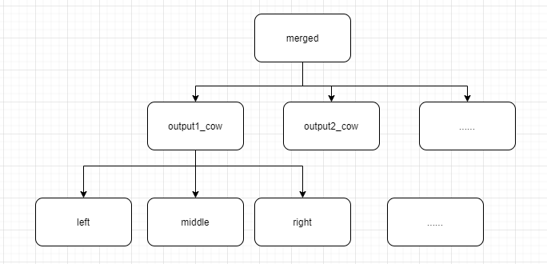

 

(3)   merge_merge.py

将两组视频生成的video1_merged和video2_merged比对合并。

主要参数：dis1=0.75, dis2=1.0, dis1_ratio=0.60, dis2_ratio=0.90

将video1_merged中的牛作为base，计算均值向量与单张图片推理向量的距离，如果video2_merged文件中的一头牛的中脸图片的距离到video1_merged中一头牛的距离小于0.75的图片数量占比大于60%则认为是同一头牛，或者距离大于1.0的图片数量占比大于90%，则认为不是同一头牛，放入另一个文件夹中，video1_merged中的这头牛继续向下匹配，如果最终没有匹配上，则认为video1_merged中的这头牛是单独的一头牛，如果出现其他的情况，则抛弃video2_merged中的这头牛。

 

(4)   base_processer.py

模型推理、入模型之前的图片预处理、文件操作等。

 

(5)   start_process.py

既可分步处理，人为检查数据质量，也可一键执行。

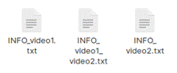

(6)  

Video1、video2视频中拍摄的牛大约在60头左右

Video1_ouput1: 50

Video1_output2: 48

Merged1: 27

Video2_ouput1: 41

Video2_ouput2: 38

Merged2: 18

Video1_video2_merged: 41

 

(7)   存在的问题及改进：

在一组视频中，存在这头牛在这一个视频中采集了，在另一个视频中没有采集

在采集过程中，一头牛没有采集到中脸，只采集到了侧脸

作为base的牛的中脸图片质量，有可能不能代表这头牛的平均向量(只需要检查output1就可以了)

视频采集的质量对于单次采集牛的数量与图片的质量较为重要

(8)   Distance

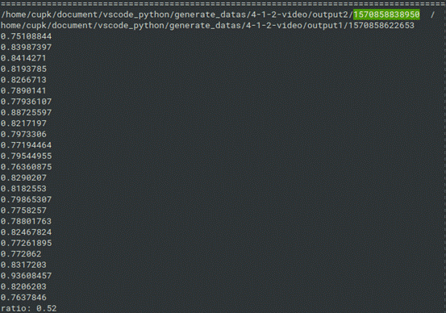

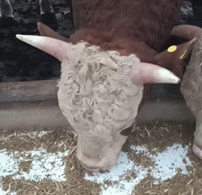 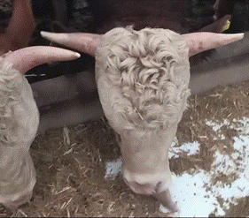

1、最终设置的参数dis=0.75，stay_ratio=0.55时，匹配成功的牛全部正确，根据上面错误匹配的经验，认为将dis_ratio设置为0.75为最佳。

2、不同视频中的同一头牛之间的距离大部分处在0.4到0.65之间。

（1）

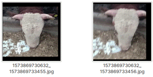

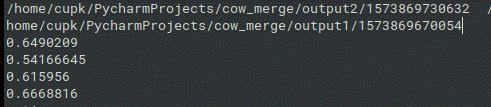

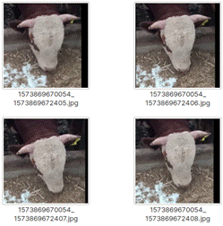

（2）

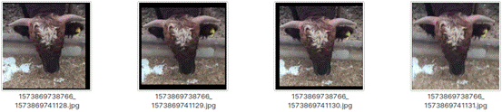

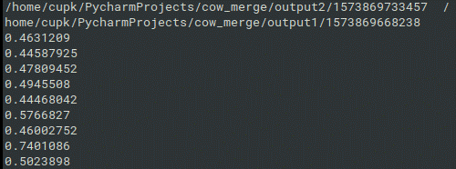

 

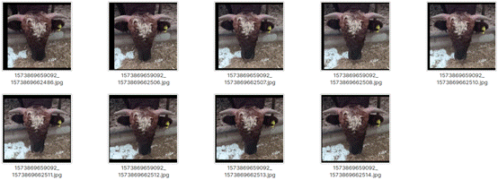

(3) 不同的牛在不同视频之间的距离大致在分布在1.0以上

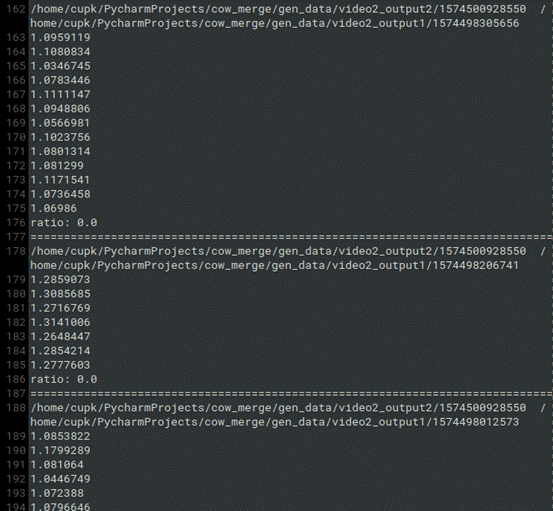

## 数据监控

**1、目录结构监控**

存在三个目录：base_zap、base_merge、tmp

Base_zap目录有一个对称目录base_merge

每一级目录下都会有一个log.txt文件，用来记录本级目录文件的路径，作为对称目录修改的依据；

通过后台程序定时监控目录中上传的数据，如果监测到有新的数据传上来，自动进行处理

**2、合并方式做了一些修改**

**3、缓存文件的设置vec.txt、tmp**

目录结构：

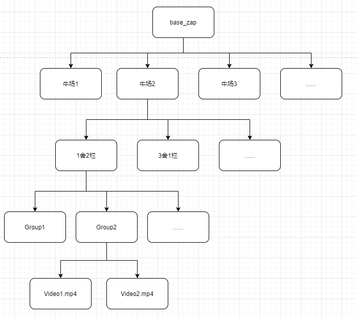